# 🍅 Smart Tomato — Détection de maladies par IA & surveillance IoT

Système intelligent complet pour la culture de la tomate, combinant **deep learning** (diagnostic des maladies de la feuille par photo) et **IoT** (surveillance environnementale en temps réel). Le modèle **MobileNetV2** est servi par une **API REST (Flask)** conteneurisée avec **Docker** et déployée sur **Google Cloud Run**, et une chaîne de capteurs **ESP8266** remonte les conditions environnementales vers **Firebase**. Le tout est piloté depuis une **application Android**.

> 📱 **Application Android associée :** [abdellatif-rhaymi/tomato-disease-detection-android-app](https://github.com/abdellatif-rhaymi/tomato-disease-detection-android-app)

---

## 🎯 Le problème

Les maladies de la tomate (mildiou, alternariose, virus…) peuvent détruire une récolte si elles ne sont pas détectées à temps, et un agriculteur n'a pas toujours d'expert à disposition. Par ailleurs, les conditions environnementales (température, humidité, luminosité) jouent un rôle clé dans l'apparition de ces maladies. Ce projet propose un outil **accessible depuis un smartphone** pour **diagnostiquer une maladie à partir d'une photo** et **surveiller l'environnement de culture** en continu.

## 🏗️ Architecture du système

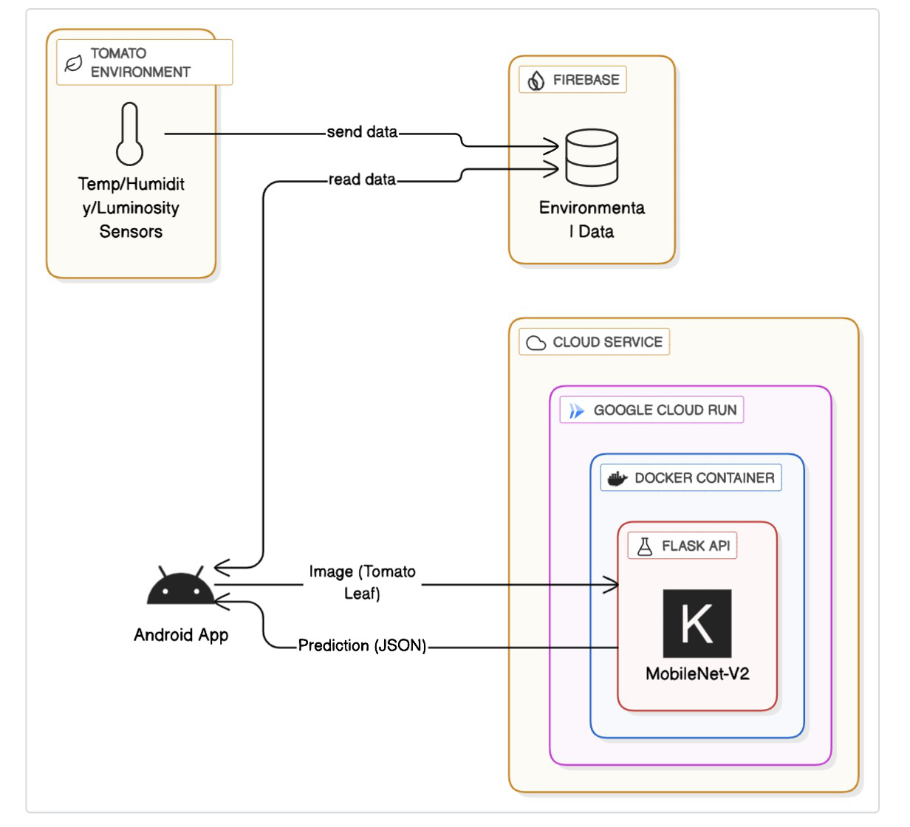

**① Chaîne IoT — surveillance environnementale**
Les capteurs (température, humidité, luminosité) reliés à un microcontrôleur **ESP8266** transmettent les mesures en **WiFi** vers **Firebase**. L'application lit ces données et les affiche sous forme de **graphiques et tableaux de bord**, avec historisation pour l'analyse des tendances.

**② Chaîne IA — diagnostic des maladies**
L'application envoie une **photo de feuille** à une **API REST Flask**, conteneurisée avec **Docker** et déployée sur **Google Cloud Run**. Le modèle **MobileNetV2** classe l'image et renvoie une **prédiction au format JSON**.

## ✨ Fonctionnalités

- 🔬 Diagnostic de **10 états** de la feuille de tomate (9 maladies + saine) à partir d'une photo
- 🌡️ **Surveillance environnementale** temps réel (température, humidité, luminosité) via capteurs IoT
- 📊 **Tableaux de bord** et historisation des données pour l'analyse des tendances
- 🔐 **Authentification** complète : inscription, vérification email, réinitialisation de mot de passe
- 👤 Gestion de profil et **historique des diagnostics** par utilisateur
- 📱 Version **TensorFlow Lite** du modèle pour l'inférence embarquée (hors-ligne)

## 🧠 Méthodologie — entraînement du modèle

### Dataset
- Sous-ensemble **tomate** du dataset [*PlantifyDr* (Kaggle)](https://www.kaggle.com/lavaman151/plantifydr-dataset), **10 classes** (9 maladies + feuille saine)
- Découpage **70 % entraînement / 15 % validation / 15 % test** (`split-folders`)
- Images redimensionnées en **224 × 224** (format attendu par MobileNetV2)
- **6 275 images** dans le jeu de test

### Phase 1 — Transfer learning
Le modèle réutilise **MobileNetV2 pré-entraîné sur ImageNet** (base **gelée**), sur laquelle est ajoutée une tête de classification adaptée aux 10 classes :
```
MobileNetV2 (gelé, ImageNet)
      └─ GlobalAveragePooling2D
          └─ Dropout(0.5)          # régularisation anti-surapprentissage
              └─ Dense(10, softmax) # couche de classification
```
- **Augmentation de données** : rescale 1/255 + flip horizontal
- **Optimiseur** : Adam, learning rate **1e-4** · **loss** : categorical crossentropy
- **Callbacks** : `EarlyStopping` (surveille `val_loss`) et `ModelCheckpoint` (sauvegarde du meilleur modèle) · batch size 32, jusqu'à 30 époques

### Phase 2 — Fine-tuning
Une fois la tête entraînée, les **couches profondes de MobileNetV2 sont dégelées** (à partir du bloc `block_14_expand`) et ré-entraînées avec un **learning rate 10× plus faible (1e-5)** pendant 8 époques. Cette seconde passe spécialise les caractéristiques du réseau sur les feuilles de tomate, sans détruire les poids ImageNet.

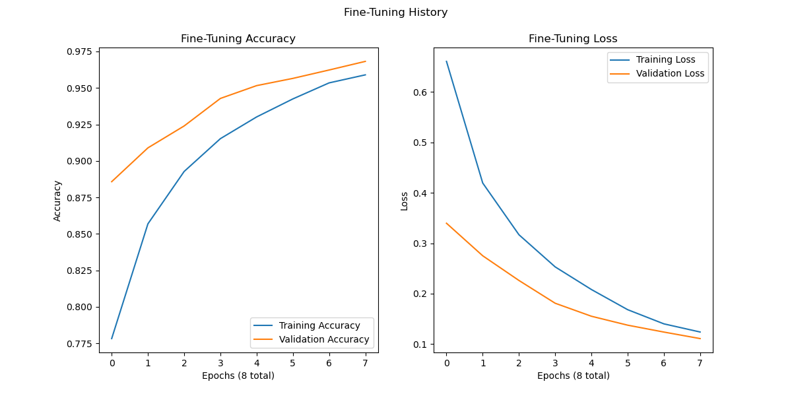

### Techniques employées
`Transfer learning` · `Fine-tuning progressif (unfreezing)` · `Data augmentation` · `Dropout` · `Early stopping` · `Model checkpointing` · `Learning rates différenciés`

## 📊 Résultats du modèle

Modèle évalué sur **6 275 images de test** :

| Métrique | Score |
|---|---|
| **Accuracy globale** | **97,02 %** |
| Precision (moy. pondérée) | 97,03 % |
| Recall (moy. pondérée) | 97,02 % |
| F1-score (moy. pondéré) | 97,02 % |

> Objectif de cahier des charges (précision ≥ 95 %, diagnostic < 5 s) **atteint**.

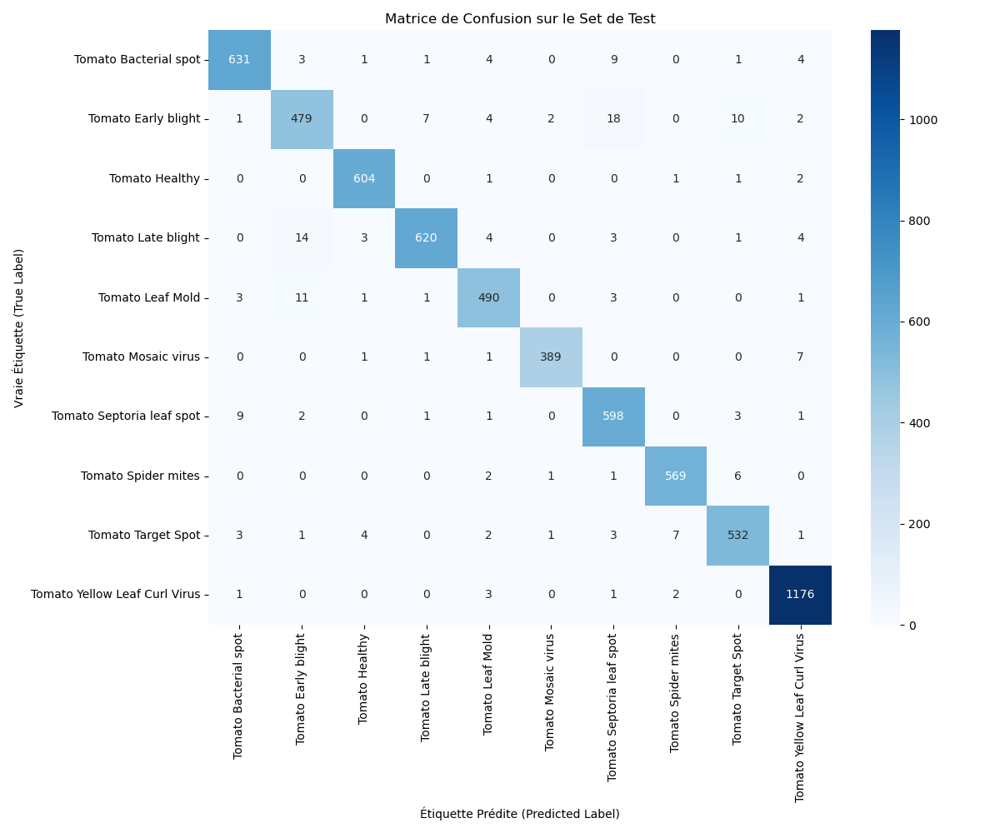

### Les 10 classes détectées
`Bacterial spot` · `Early blight` · `Healthy` · `Late blight` · `Leaf Mold` · `Mosaic virus` · `Septoria leaf spot` · `Spider mites` · `Target Spot` · `Yellow Leaf Curl Virus`

Dataset (feuilles saines et malades, 10 classes) :

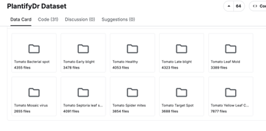

## 🔌 Le montage IoT

| Schéma du circuit (Fritzing) | Prototype réel |
|:---:|:---:|
| 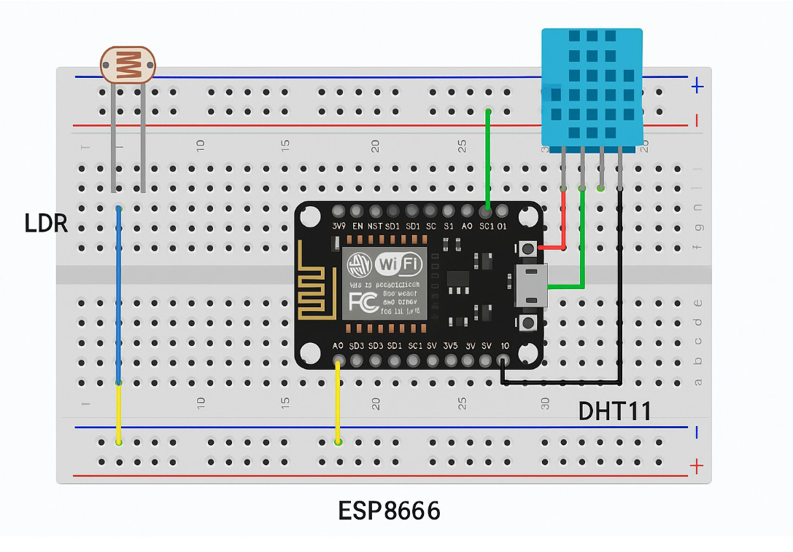 | 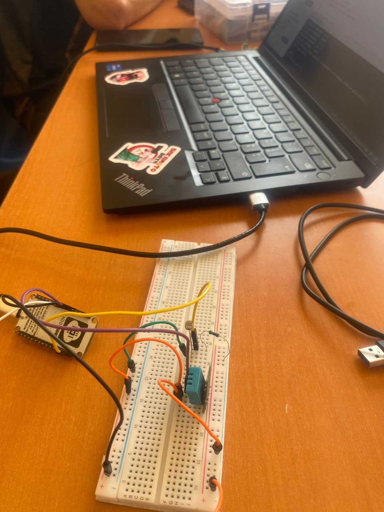 |

Capteurs **DHT11** (température/humidité) et **LDR** (luminosité) reliés à un **ESP8266**, qui transmet les mesures en WiFi vers Firebase.

## 📱 Aperçu de l'application

| Détection de maladie | Surveillance environnementale | Accueil |
|:---:|:---:|:---:|
| 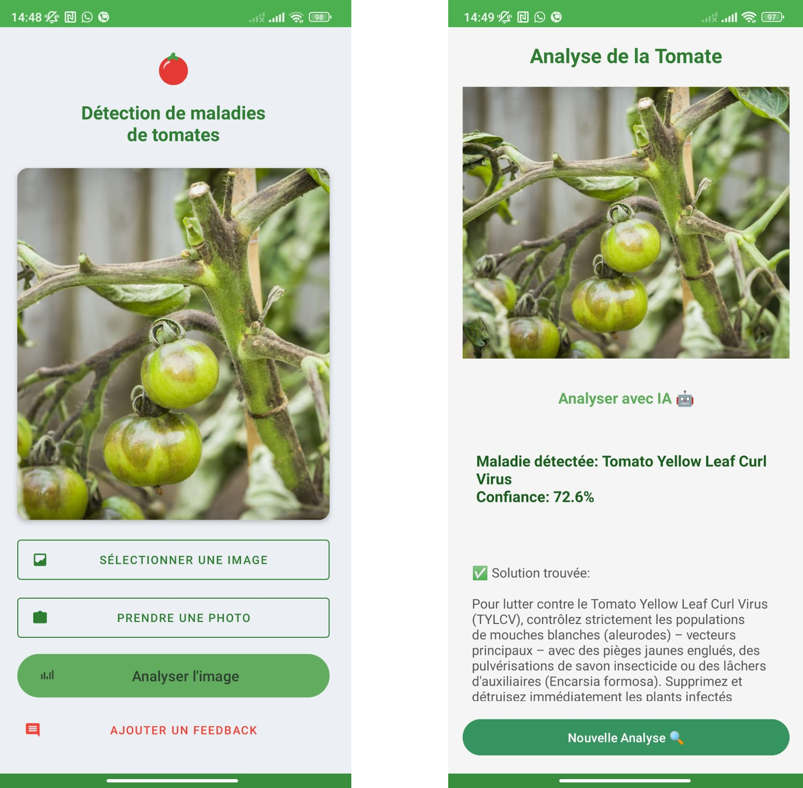 | 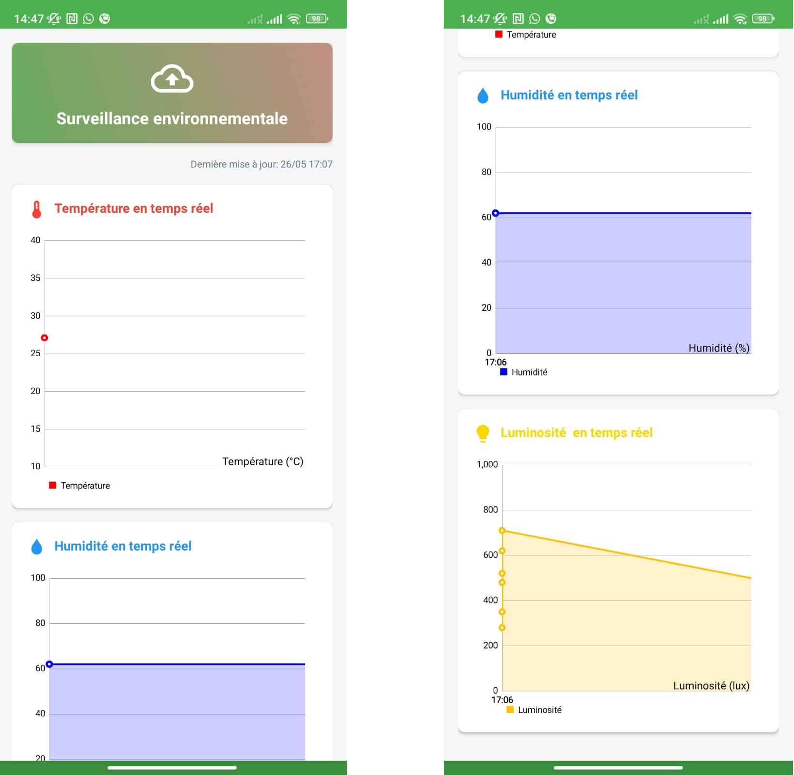 | 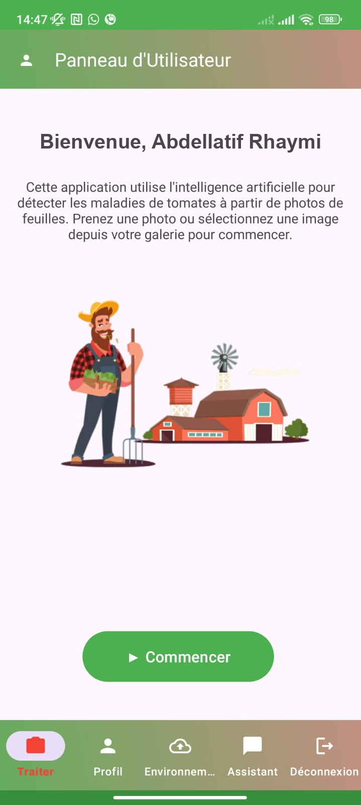 |

| Authentification | Profil / Assistant | Panneau d'administration |
|:---:|:---:|:---:|
| 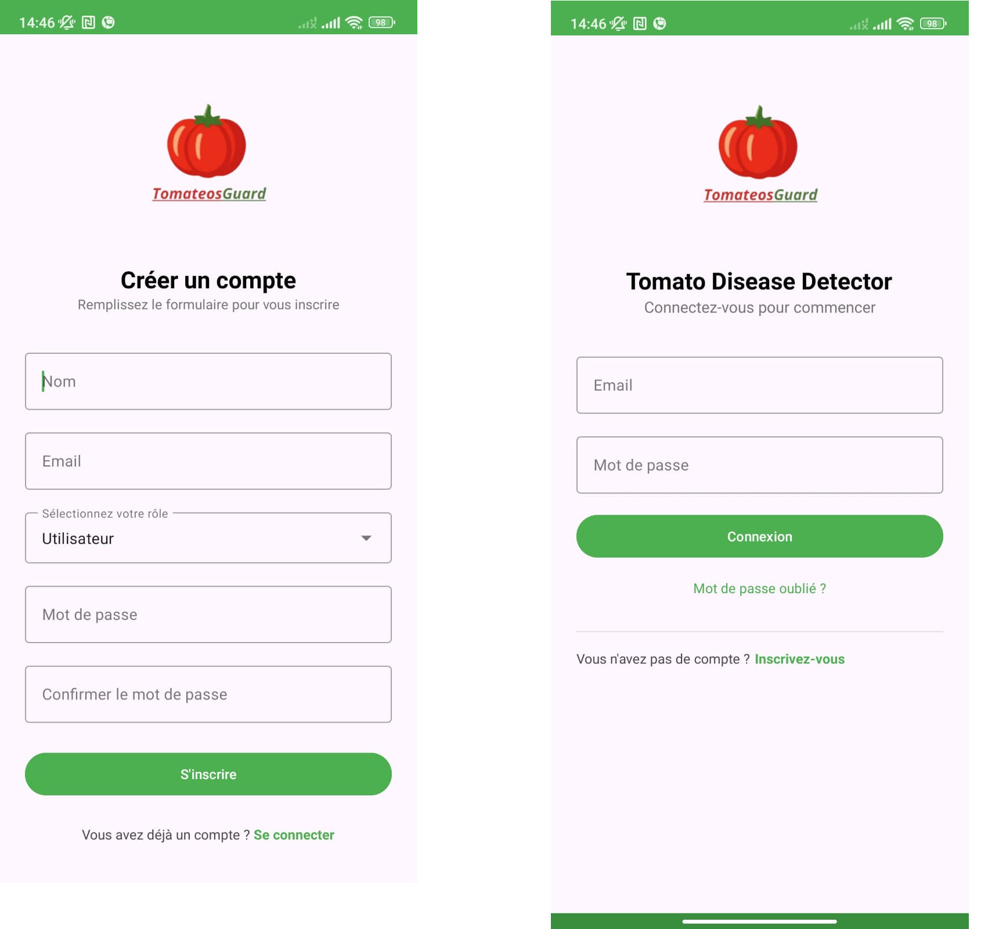 | 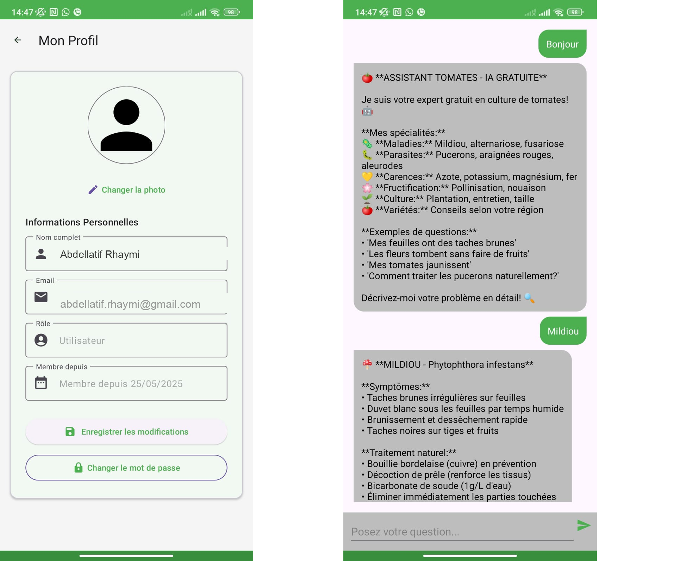 | 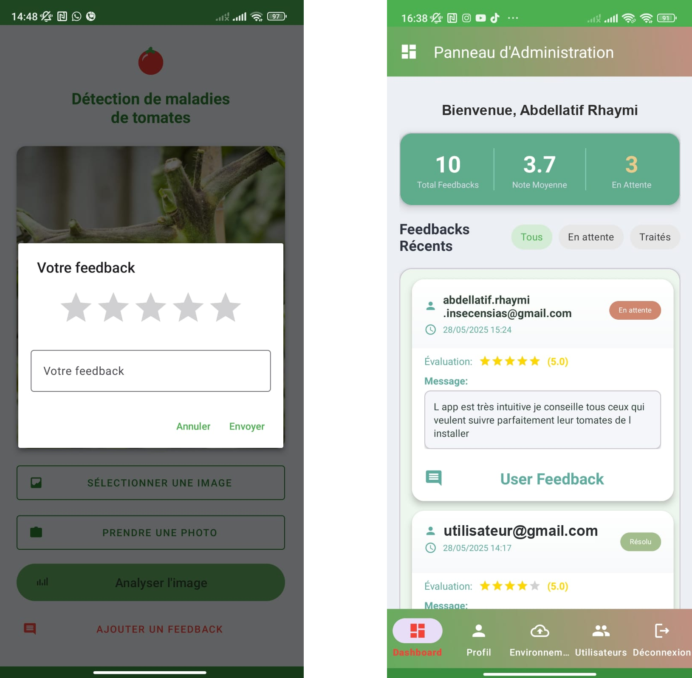 |

## 📐 Conception (UML)

| Diagramme de cas d'utilisation | Diagramme de séquence |
|:---:|:---:|
| 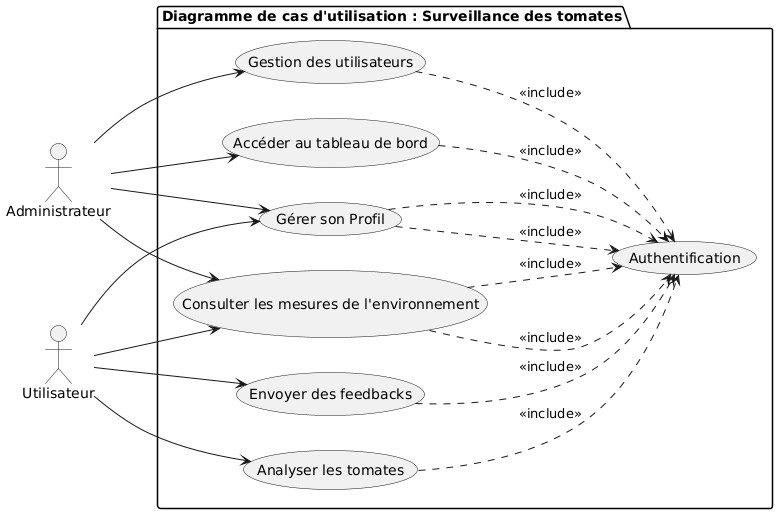 | 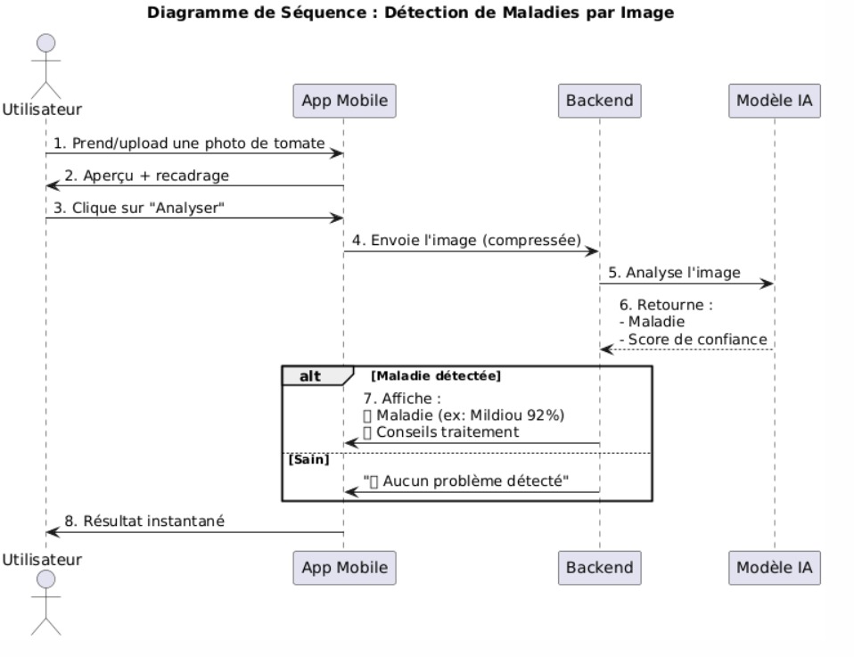 |

## 🛠️ Stack technique

| Domaine | Technologies |
|---|---|
| **Deep Learning** | Python · TensorFlow / Keras · MobileNetV2 (transfer learning + fine-tuning) · TensorFlow Lite |
| **API** | Flask · Pillow · NumPy |
| **Cloud & Déploiement** | Docker · Cloud Build · Artifact Registry · **Google Cloud Run** (serverless) |
| **IoT** | ESP8266 · capteur DHT11 (temp./humidité) · LDR (luminosité) · WiFi |
| **Backend données** | Firebase (Realtime Database, Auth) |
| **Mobile** | Android (Java) — [repo dédié](https://github.com/abdellatif-rhaymi/tomato-disease-detection-android-app) |

## 📁 Structure du dépôt

```
├── train_tomato_model.py      # Entraînement (transfer learning MobileNetV2)
├── finetune_tomato_model.py   # Fine-tuning du modèle
├── evaluate_model.py          # Évaluation + matrice de confusion
├── split_data.py              # Découpage train / val / test
├── convert_to_tflite.py       # Conversion en TensorFlow Lite (mobile)
├── tomato_api_server/         # API REST Flask + Dockerfile (Cloud Run)
│   ├── main.py
│   ├── Dockerfile
│   └── requirements.txt
├── conversion_docker/         # Conteneur de conversion Keras → TFLite
├── classification_report_final.txt
└── confusion_matrix_final.png
```

## 🚀 Lancer l'API en local (Docker)

```bash
cd tomato_api_server
docker build -t tomato-api .
docker run -p 8080:8080 tomato-api
```

Tester une prédiction :
```bash
curl -X POST -F "file=@feuille.jpg" http://localhost:8080/predict
```
Réponse :
```json
{ "prediction": "Tomato Late blight", "confidence": 0.98 }
```

## ☁️ Déploiement sur Google Cloud Run

L'API est **serverless** : le conteneur Docker est déployé sur **Google Cloud Run**, qui fournit une URL HTTPS publique et gère la montée en charge automatiquement. L'application lit le port via la variable d'environnement `$PORT` et écoute sur `0.0.0.0` — la configuration attendue par Cloud Run.

```bash
# 1. Construire l'image et la pousser dans Artifact Registry
gcloud builds submit --tag REGION-docker.pkg.dev/PROJET/REPO/tomato-api ./tomato_api_server

# 2. Déployer le conteneur sur Cloud Run
gcloud run deploy tomato-api \
  --image REGION-docker.pkg.dev/PROJET/REPO/tomato-api \
  --platform managed \
  --region REGION \
  --allow-unauthenticated
```

Cloud Run renvoie alors une URL du type `https://tomato-api-xxxx.run.app`, que l'application Android appelle pour le diagnostic.

> **Pile cloud utilisée :** Docker (conteneurisation) · Cloud Build (build de l'image) · Artifact Registry (stockage de l'image) · **Cloud Run** (exécution serverless).

## 👤 Auteur

**Abdellatif RHAYMI** — Ingénieur d'État en Informatique (ENSIAS)
[LinkedIn](https://www.linkedin.com/in/abdellatif-rhaymi/) · [GitHub](https://github.com/abdellatif-rhaymi)
